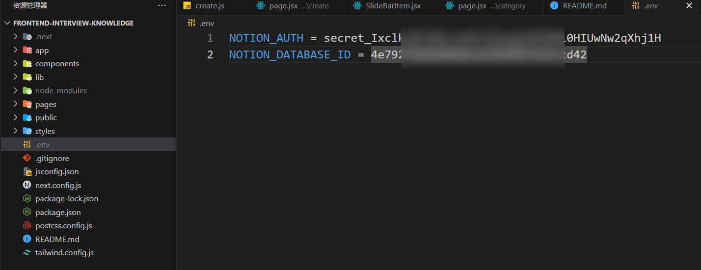

# 前端知识图谱
<div align="center" >
	
  <p>短小、精悍、直击要害</p>
  <p>学习、面试必备之良器</p>
</div>


## 安装 markdown-it 和hljs
```js
npm i markdown-it

npm i  highlight.js
```
使用
```js
import React, { useState,useEffect } from 'react'
// 1. 引入markdown-it库
import markdownIt from 'markdown-it'
import hljs from "highlight.js";
import 'highlight.js/styles/monokai-sublime.css'
// 2. 生成实例对象
const md = new markdownIt({
  highlight: function (str, lang) {
    if (lang && hljs.getLanguage(lang)) {
      try {
        return hljs.highlight(str, { language: lang }).value;
      } catch (_) {}
    }
    return ""; // 使用额外的默认转义
  },
});

// 3. 解析markdown语法
    const parse = (text: string) => setHtmlString(md.render(text));
    useEffect(()=>{
        parse()
    },[])


 <div 
    className="show" 
    dangerouslySetInnerHTML={{ __html: htmlString }} // 将html字符串解析成真正的html标签
/>

```

## env文件
